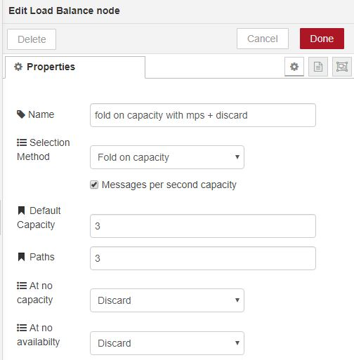
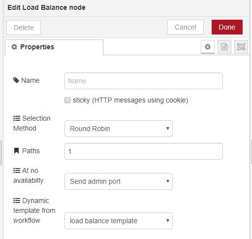
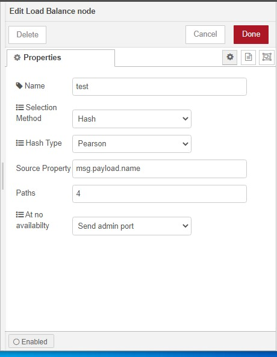
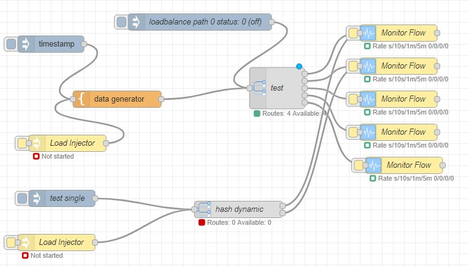
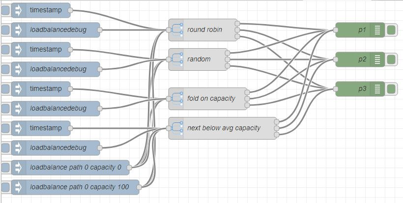
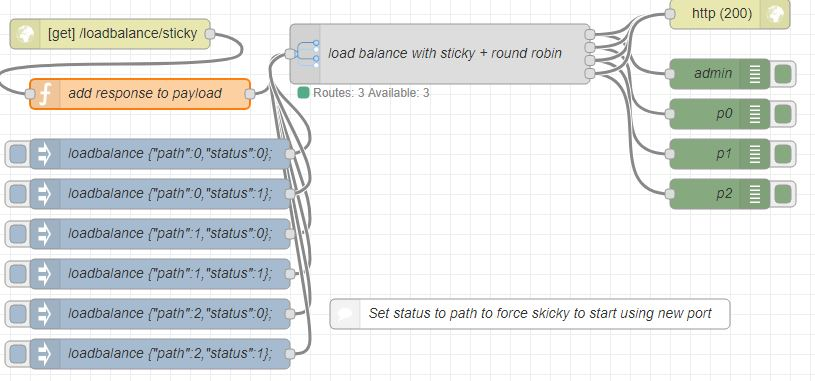
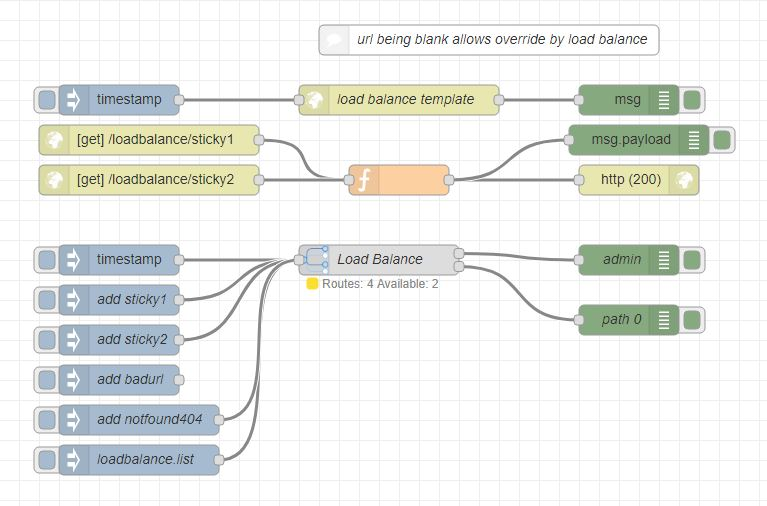

# node-red-contrib-loadbalance  

[Node-Red][1] node to [load balance][2] either with static routes or dynamic routes.

Basically spreads input messages to flows based on:
* Round Robin - next in list then start at being again
* Hash - Hash art of message to determine route (quasi sticky route)
* Random - randomly across out paths
* Fold on capacity - place load on first node in order with capacity.  Good for improving cache hit ratios. At full capacity random selection.
* Next smoothing to average capacity - next that is >= average capacity to get smoothing of load. At full capacity random selection.
* Persist path states and capacity on recycle in context storage - need to defined content persistence in nodered settings, see https://nodered.org/docs/user-guide/context 

This allows incoming messages to be passed to servers that may be other node red instances.

For HTTP sticky can be selected.  This stores the path in a cookie and the same path is reused so long as it is available and the cookie information is maintained on message.

Out port zero is used for administration and used to send message if there is no availability in all routes.  This allows responses messages or queuing to be managed.

Message per second capacity is visible when capacity based mode is selected.  Indicates capacity is many messages per second are allowed.

Default capacity is visible when capacity based mode is selected.

At no capacity is visible when capacity based mode is selected. Allows choice of what is to be done with message when full capacity is reached.

At no availablity allows  choice of what is to be done with message when there is no availabilty.  Messages either discarded or sent to admin port.

#### Static paths

#### Dynamic paths
When paths equal 1 a template in workflow can be selected.

Only "http request" types work at this stage and it requires the template to have url set to blank.
See test for details.

------------------------------------------------------------

# Management

Messages can be sent to node with the following topics and not forwarded 

## msg.topic loadbalance

Takes in metrics and availablity for a path in msg.payload in form:

	{path: <path number>, capacity: <numeric value>, status: <0=unavailable>} 

or and array of above.

Capacity of zero is considered saturation.  Positive values are expected.

Basically a remote node could be constructed to send a message to update 

## msg.topic loadbalance.list

Will send metadata about queues to admin output port.

## msg.topic loadbalance.debug

Will send metadata about queues to error log so visible in debug console.

## msg.topic loadbalance.route

If paths set to 1 and template selected enables dynamic routing.
Current only "http request" template allowed.  
Form of payload {url:"/a/url/path"}

## msg.topic loadbalance.save

Persists path metrics and states

## msg.topic loadbalance.saveDetails

Content of save metrics

------------------------------------------------------------

# Hash routing

Routing can be based on a hash or a property in the message.  See pane below.
Either FNV or Pearson hashing technique can be used.
If Pearson at most 256 routes are possible as this is the lookup size used.
The if an odd number of routes, 1 route will receive proportional less activity based number of routes. 

Example flow included in test folder.

------------------------------------------------------------

# Wish List

* Alive polling, keep alive can be used to trigger remote to send capacity metrics (note, this could be done by flow)
* Other dynamic template node types e.g. mq, http out etc.
* Dynamic addition of paths by discovery (note, this could be done by flow)
* Some base capacity calls to remote engines  (note, this could be done by flow)
* mps - default base capacity set per path at setup

------------------------------------------------------------

# Install

Run the following command in the root directory of your Node-RED install

    npm install node-red-contrib-loadbalance

#### Tests

Test/example flow in  test/testflow.json

Test flow for sticky feature in test/testSticky.json

Test flow for sticky feature in test/testDynamic.json

------------------------------------------------------------

# Version

0.6.0 Persist metrics and paths

0.5.0 Add hash on part of msg to determine path, improve dynamic and fix bug when duplicate path 

0.4.0 Initial release

# Author
  
[Peter Prib][3] 

[1]: http://nodered.org "node-red home page"

[2]: https://www.npmjs.com/package/node-red-contrib-loadbalance "source code"

[3]: https://github.com/peterprib "base github"
